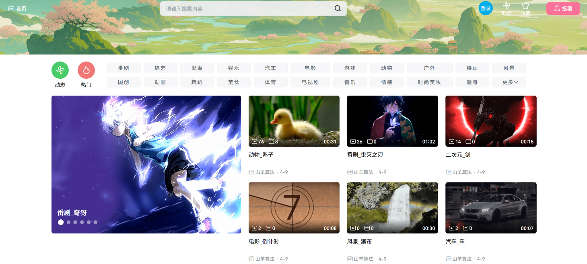
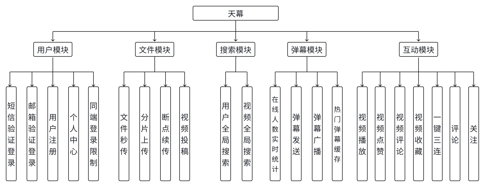
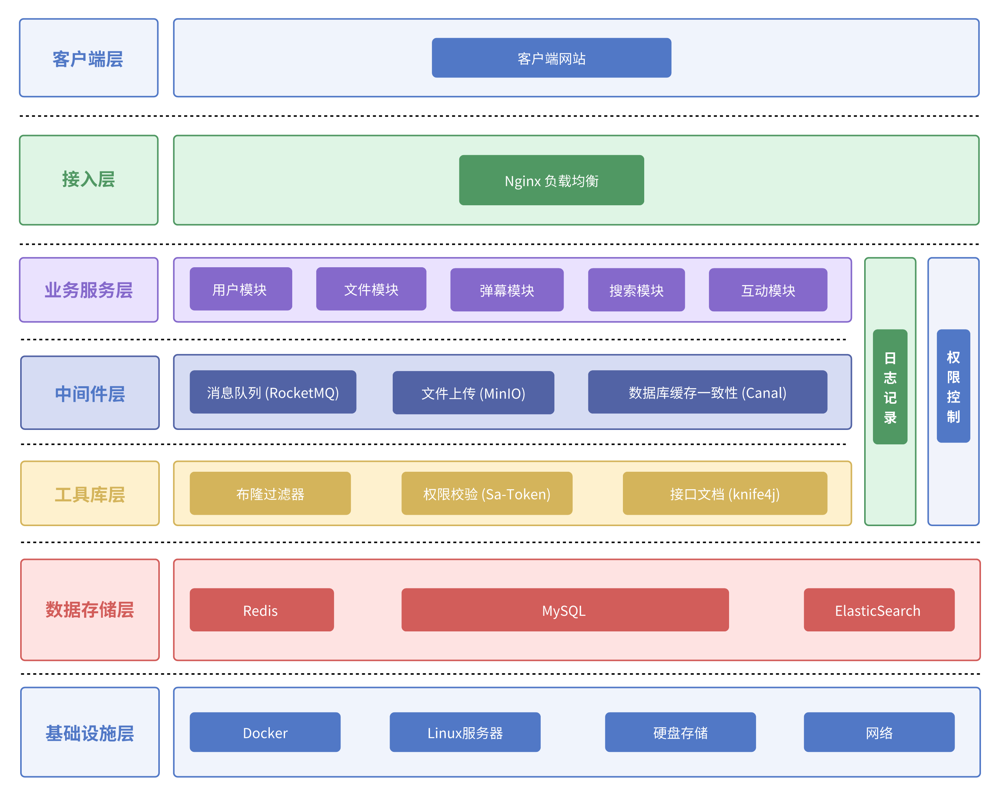

#  DokiTV视频互动平台

## 项目简介

 DokiTV是一款**高并发、易扩展的视频互动平台**，聚焦视频播放、实时弹幕、用户互动等核心场景，旨在解决传统视频平台架构老旧、扩展性弱的问题，同时通过技术落地展示主流互联网产品的底层实现逻辑。

## 效果预览

## 项目背景

随着视频内容生态的爆发，市面上多数老旧项目存在架构僵化、并发支撑不足的问题。 DokiTV平台以“易扩展、高性能”为核心目标：

1. 区别于传统老旧项目，采用分层架构+微服务思想设计，适配高并发场景；

2. 预留充足扩展接口，支持后续功能迭代（如直播、付费内容等）；

3. 落地主流中间件与架构方案，还原生活中常用视频APP的底层技术原理。

## 产品亮点

- **架构领先**：摆脱传统项目的技术栈，采用现代化分层架构，适配高并发、高可用场景；

- **易扩展性**：模块解耦+中间件抽象，后续新增功能（如直播、社区）无需重构核心架构；

- **技术落地**：通过实际场景（如实时弹幕、文件秒传）展示互联网产品的底层实现逻辑，兼具学习与实用价值。

## 技术亮点

1. **高并发视频播放优化**：通过Nginx负载均衡+静态资源缓存，提升视频播放的稳定性与响应速度；

2. **实时弹幕高并发处理**：基于RocketMQ实现弹幕异步削峰，高峰期保障弹幕的实时性与系统稳定性；

3. **缓存数据一致性保障**：通过Canal监听MySQL Binlog，实现Redis与数据库的最终一致性；

4. **高性能文件处理**：基于MinIO实现文件秒传、分片上传、断点续传，提升大文件（视频）的上传成功率；

5. **千万级实时长连接**：通过Netty实现长连接管理，支撑高并发场景下的实时互动（如弹幕、点赞通知）；

6. **智能搜索体系**：基于ElasticSearch + IK分词器实现精准、高效的内容搜索与聚合；

7. **弹幕时序性保障**：采用Redis Zset存储弹幕数据，实现按时间戳自动排序，确保弹幕展示的时序正确性；

8. **缓存穿透防护**：通过布隆过滤器拦截非法视频ID请求，避免缓存与数据库的无效查询；

9. **安全认证体系**：基于JWT实现登录验证，支持同端登录检测与请求拦截；

10. **操作频率限制**：通过Redis Lua脚本实现点赞、收藏等操作的频率控制，保护系统资源。

## 技术选型

| 技术栈 | 版本号 |
| ----- | ----- |
| SpringBoot | 2.6.13 / 3.5.4（多服务适配） |
| JDK | 17 |
| Maven | 3.6.1 |
| MySQL | 8.0 |
| Canal | v1.1.7 |
| RocketMQ | 5.2.0 |
| ElasticSearch | 7.17.23 |
| Kibana | 7.17.23 |
| IK 分词器 | 7.17.23 |
| MinIO | RELEASE.2025-02-18T16-25-55Z |
| Redis | 7.4.0 |
| npm | 11.0.0 |
| Node | v22.11.0 |

